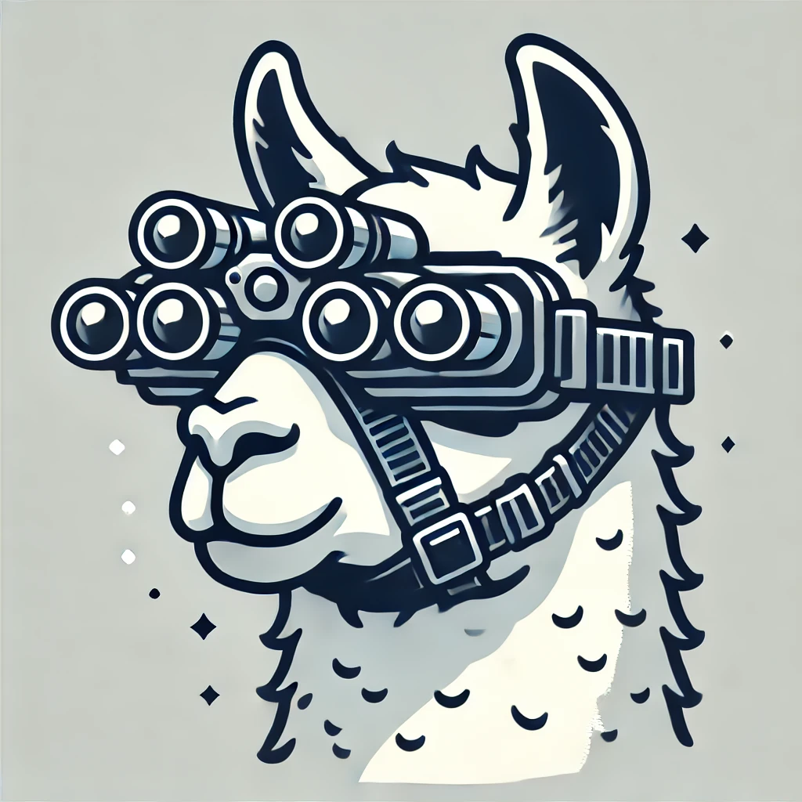
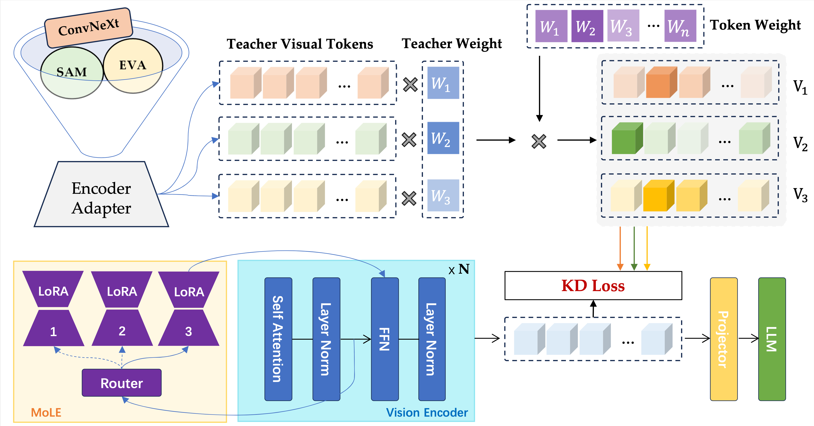

#  MoVE-KD: Knowledge Distillation for VLMs with Mixture of Visual Encoders 
[【CVPR 2025】MoVE-KD: Knowledge Distillation for VLMs with Mixture of Visual Encoders](https://arxiv.org/abs/2501.01709)  
[Jiajun Cao](https://scholar.google.com.hk/citations?user=femNsd0AAAAJ&hl=zh-CN), [Yuan Zhang](https://scholar.google.com.hk/citations?hl=zh-CN&user=dXj1WskAAAAJ), [Tao Huang](https://scholar.google.com.hk/citations?user=jkcRdBgAAAAJ&hl=zh-CN), Ming Lu, Qizhe Zhang, Ruichuan An, Ningning MA, [Shanghang Zhang](https://scholar.google.com.hk/citations?user=voqw10cAAAAJ&hl=zh-CN)

## Overview


Visual encoders are fundamental components in vision-language models (VLMs), each showcasing unique strengths derived from various pre-trained visual foundation models. To leverage the various capabilities of these encoders, recent studies incorporate multiple encoders within a single VLM, leading to a considerable increase in computational cost. In this paper, we present Mixture-of-Visual-Encoder Knowledge Distillation (MoVE-KD), a novel framework that distills the unique proficiencies of multiple vision encoders into a single, efficient encoder model. Specifically, to mitigate conflicts and retain the unique characteristics of each teacher encoder, we employ low-rank adaptation (LoRA) and mixture-of-experts (MoEs) to selectively activate specialized knowledge based on input features, enhancing both adaptability and efficiency. To regularize the KD process and enhance performance, we propose an attention-based distillation strategy that adaptively weighs the different visual encoders and emphasizes valuable visual tokens, reducing the burden of replicating comprehensive but distinct features from multiple teachers.

## News
- [2025/2/26] 🔥 The code of **MoVE-KD** is released.

- [2025/2/26] 🔥 **[MoVE-KD](https://arxiv.org/abs/2501.01709)** is accepted by **CVPR 2025**.


[](https://github.com/tatsu-lab/stanford_alpaca/blob/main/LICENSE)
**Usage and License Notices**: This project utilizes certain datasets and checkpoints that are subject to their respective original licenses. Users must comply with all terms and conditions of these original licenses, including but not limited to the [OpenAI Terms of Use](https://openai.com/policies/terms-of-use) for the dataset and the specific licenses for base language models for checkpoints trained using the dataset (e.g. [Llama community license](https://ai.meta.com/llama/license/) for LLaMA-2 and Vicuna-v1.5). This project does not impose any additional constraints beyond those stipulated in the original licenses. Furthermore, users are reminded to ensure that their use of the dataset and checkpoints is in compliance with all applicable laws and regulations.


## Contents
- [Install](#install)
- [MoVE-KD Weights](#move-kd-weights)
- [Train](#train)
- [Evaluation](#evaluation)

## Install

If you are not using Linux, do *NOT* proceed, see instructions for [macOS](https://github.com/haotian-liu/LLaVA/blob/main/docs/macOS.md) and [Windows](https://github.com/haotian-liu/LLaVA/blob/main/docs/Windows.md).

1. Clone this repository and navigate to LLaVA folder
```bash
git clone https://github.com/hey-cjj/MoVE-KD.git
cd MoVE-KD
```

2. Install Package
```Shell
conda create -n move-kd python=3.10 -y
conda activate move-kd
pip install --upgrade pip  # enable PEP 660 support
pip install -e .
```

3. Install additional packages for training cases
```
pip install -e ".[train]"
pip install flash-attn --no-build-isolation
```

## MoVE-KD Weights
| **Method** | **LLM** | **VQAv2** | **GQA** | **TextVQA** | **VizWiz** | **POPE** | **SQA** | **MME** | **MMB** |
| :---: | :---: | :---: | :---: | :---: | :---: | :---: | :---: | :---: | :---: |
| LLaVA-v1.5 | Vicuna-7B| 78.5 | 62.0 | 58.2 | 50.0 | 85.9 | 66.8 | 1510.7 | 64.3 |
| [MoVE-KD-v1.0](https://huggingface.co/jiaojuncao/MoVE-KD-7b-v1.0)  | Vicuna-7B| 79.5 | 63.2 | 58.3 | 52.3 | 86.9 | 69.3 | 1524.5 | 66.3 |
| [MoVE-KD-v1.1](https://huggingface.co/jiaojuncao/MoVE-KD-7b-v1.1)  | Vicuna-7B| 79.9 | 63.9 | 59.6 | 52.7 | 86.3 | 69.8 | 1509.1 | 67.4 |
| LLaVA-v1.5 | Vicuna-13B| 80.0 | 63.3 | 61.3 | 53.6 | 85.9 | 71.6 | 1531.3 | 67.7 |
| [MoVE-KD-v1.0](https://huggingface.co/jiaojuncao/MoVE-KD-13b-v1.0) | Vicuna-13B| 80.6 | 64.2 | 59.7 | 55.7 | 85.7 | 73.2 | 1568.1 | 70.2 |
| [MoVE-KD-v1.1](https://huggingface.co/jiaojuncao/MoVE-KD-13b-v1.1) | Vicuna-13B| 80.8 |  63.9 | 61.1 | 57.5 | 86.3 | 71.8 | 1568.3 | 69.7 |
## Train
Our training procedure is consistent with LLaVA, consisting of two stages: pre-training and fine-tuning. In the pre-training stage, we tune the parameter weights of the student encoder’s MoLE, encoder adapters, and projector, while freezing all other parameter weights. In the fine-tuning stage, all parameter weights are updated except those of the teacher encoders.

### Pre-training 
Training script with DeepSpeed ZeRO-2: [`pretrain-v1.0.sh`](./scripts/move-kd/pretrain-v1.0.sh) and  [`pretrain-v1.1.sh`](./scripts/move-kd/pretrain-v1.1.sh).


### Fine-tuning

Training script with DeepSpeed ZeRO-2: [`finetune-v1.0.sh`](./scripts/move-kd/finetune-v1.0.sh) and  [`finetune-v1.1.sh`](./scripts/move-kd/finetune-v1.1.sh).


## Evaluation
See [Evaluation.md](https://github.com/haotian-liu/LLaVA/blob/main/docs/Evaluation.md).


## Citation

If you find MoVE-KD useful for your research and applications, please cite using this BibTeX:
```bibtex
@article{cao2025move,
  title={MoVE-KD: Knowledge Distillation for VLMs with Mixture of Visual Encoders},
  author={Cao, Jiajun and Zhang, Yuan and Huang, Tao and Lu, Ming and Zhang, Qizhe and An, Ruichuan and Ma, Ningning and Zhang, Shanghang},
  journal={arXiv preprint arXiv:2501.01709},
  year={2025}
}

```

## Acknowledgement

- Our code is built on [LLaVA](https://github.com/haotian-liu/LLaVA) and [EAGLE](https://github.com/NVlabs/EAGLE)